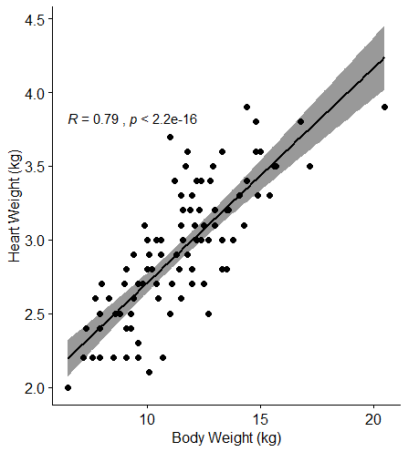

<style type="text/css">

h1.title {
  font-size: 38px;
  color: Black;
  text-align: center;
}
h4.author { /* Header 4 - and the author and data headers use this too  */
    font-size: 18px;
  color: Black;
  text-align: center;
}
h4.date { /* Header 4 - and the author and data headers use this too  */
  font-size: 18px;
  color: Black;
  text-align: center;
}
</style>
```{r setup, include=FALSE}
knitr::opts_chunk$set(echo = TRUE)
```
<center>
## We all love a chonky cat.
Case in point, this beautiful creature:
<br>
<br>

<br>
Fat cats, or "chonky" cats, have taken over the internet and our hearts. <3 

There are memes about chonky cats:
<br>
<center>

</center>
<br>
There's even quizzes you can take to see what kind of chonky cat you are. 
I, personally, am Business Chonk.


(*Psst! If you're interested, you can take it here*: https://www.buzzfeed.com/mccracken/which-chonk-are-you-61t0imqnhg)
<br>
<br>
It's hard pressed to go on your favorite social media platform and NOT see a chonky cat. You yourself might be a wonderful owner to such rotund, ethereal beings.
<br>
<br>
But being a chonky cat has a dark side...

## Chonky Cat Status Impacts Health

Here, we're going to look at some data compiled that compares feline body weight size to heart size. 


First, let's start with a simple scatter plot to look at the relationship between body weight and heart rate:

```{r cars, echo=FALSE}
cats <- read.csv("data/cats.csv")
plot(cats$Hwt ~ cats$Bwt, las=1, main = "Relationship between Feline body weight and heart rate", xlab = "Body weight (kg)", ylab = "Heart weight (kg)", pch = 16, cex = 1, col = "dodger blue")
abline(lm(cats$Hwt~cats$Bwt), col="gold", lwd=3)
```

Okay, we can see there's a linear relationship between the two.
<br>
Now, let's test to see if there's a significant difference:
<br>
<br>
<center>

</center>
Ah ha! There's is a significant relationship between a cat's body weight and its heart weight (p value = <0.001)!

## Implications
Heart disease can be associated with enlarged hearts and affects up to 15% of household cat populations (Freeman et al 2017)
While obesity may not be a direct cause of heart disease, it does have a deleterious effect on survivorship of heart disease patients (Finn et al. 2010). However, cats with heart disease do fare better if they're *slightly* over their ideal body weight than those that are underweight (Finn et al. 2010). 

## What you need to do
Sit down and have a good long talk about diet and proper exercise with your cat. Take them to the vet at least once a year (twice if they're over 6 years old) for a good ol' exam and get your veterinarian in on the discussion about it. Your veterinarian should have a handy chart that you can use to show your cat what you're talking about, like this guy below is doing. Cats are visual learners, as everyone knows. Don't forget to give them an extra treat or two to keep them in the "fluffy" range...

<center>

</center>


## The End
</center>
<center>

</center>
<br>
**Literature Cited:**
<br>
Finn E, Freeman LM, Rush JE, Lee Y. 2010. The relationship between body weight, condition, and survival in cats with heart failure. Journal of Veterinary Internal Medicine **24**(6):1369-1374.
<br>
Freeman LM, Rush JE, Stern JA, Huggins GS, Maron MS. 2017. Feline hypertrophic cardiomyopathy: A spontaneous large animal model of human HCM. Cardiology Research **8**(4):139–142. 